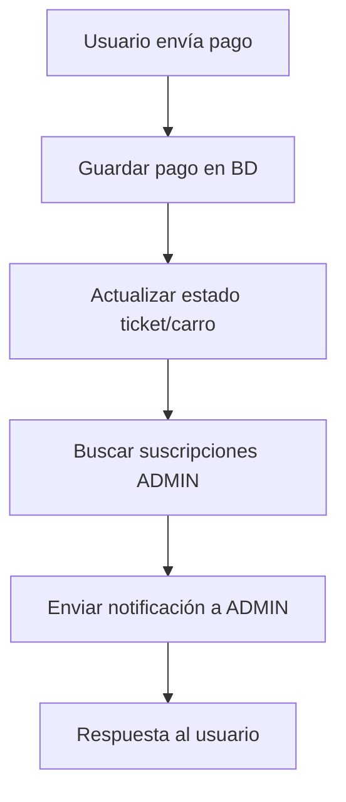
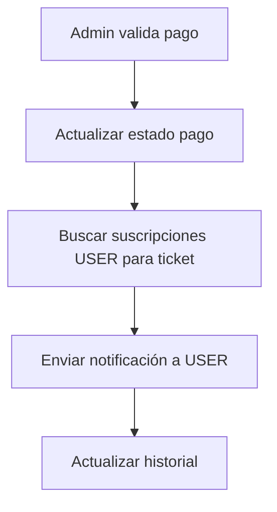
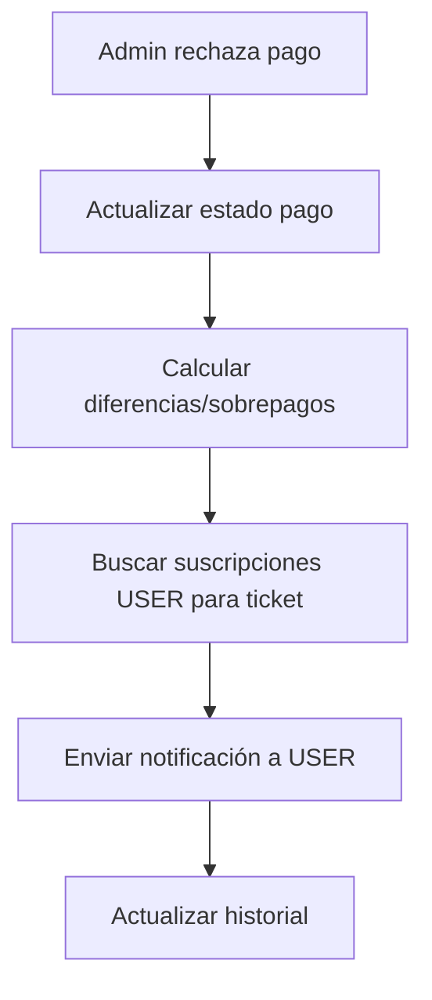
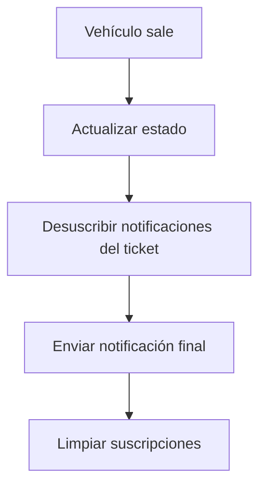

```markdown
# Notificaciones Push - Implementación y Flujo

## 1. Registro Exitoso del Vehículo
**Código Implementado:**
```typescript
// Después del registro exitoso del vehículo
if ('serviceWorker' in navigator && 'PushManager' in window) {
  let registration = await navigator.serviceWorker.getRegistration();
  if (!registration) {
    registration = await navigator.serviceWorker.register('/sw.js');
  }
  let permission = Notification.permission;
  if (permission === 'default') {
    permission = await Notification.requestPermission();
  }
  if (permission === 'granted') {
    let subscription = await registration.pushManager.getSubscription();
    if (!subscription) {
      subscription = await registration.pushManager.subscribe({
        userVisibleOnly: true,
        applicationServerKey: process.env.NEXT_PUBLIC_VAPID_PUBLIC_KEY
      });
    }
  }
}
```
```plaintext
// Suscribir como admin
await fetch('/api/push-subscriptions', {
  method: 'POST',
  body: JSON.stringify({
    subscription,
    userType: 'admin',
    ticketCode: formData.ticketAsociado
  })
});
// Suscribir como user para el ticket específico
await fetch('/api/push-subscriptions', {
  method: 'POST',
  body: JSON.stringify({
    subscription,
    userType: 'user',
    ticketCode: formData.ticketAsociado
  })
});
```

## 2. Usuario Envía Pago
**Archivo:** `src/app/api/user/submit-payment/route.ts`

**Diagrama de Flujo:**


**Notificación Enviada:**
- **Destinatario:** Administradores
- **Tipo:** `payment_received`
- **Contenido:** "💰 Nuevo Pago Recibido - Pago de Bs. X recibido para el vehículo PLACA (TICKET) vía TIPO_PAGO. Requiere validación."

## 3. Admin Valida Pago
**Archivo:** `src/app/api/admin/validate-payment/route.ts` (ya existía)

**Diagrama de Flujo:**


**Notificación Enviada:**
- **Destinatario:** Usuario del ticket específico
- **Tipo:** `payment_validated`
- **Contenido:** "✅ Pago Validado - Tu pago de Bs. X para el ticket TICKET ha sido validado. Ya puedes solicitar la salida de tu vehículo."

## 4. Admin Rechaza Pago
**Archivo:** `src/app/api/admin/reject-payment/route.ts`

**Diagrama de Flujo:**


**Notificación Enviada:**
- **Destinatario:** Usuario del ticket específico
- **Tipo:** `payment_rejected`
- **Contenido:** "❌ Pago Rechazado - Tu pago para el ticket TICKET ha sido rechazado. Motivo: RAZON. Por favor, intenta nuevamente."

## 5. Salida del Vehículo
**Archivo:** `src/app/api/admin/vehicle-exit/route.ts` (pendiente implementar)

**Diagrama de Flujo:**


## API Endpoints

### 1. Gestión de Suscripciones
- **POST** `/api/push-subscriptions`
  ```typescript
  {
    subscription: PushSubscription,
    userType: "admin" | "user",
    ticketCode?: string // Requerido para users
  }
  ```
- **DELETE** `/api/push-subscriptions`
  ```typescript
  {
    endpoint: string
  }
  ```

### 2. Envío de Notificaciones
- **POST** `/api/send-notification`
  ```typescript
  {
    type: "payment_received" | "payment_validated" | "payment_rejected" | "vehicle_exit",
    ticketCode: string,
    userType: "admin" | "user",
    data: {
      amount?: number,
      plate?: string,
      reason?: string,
      paymentType?: string
    }
  }
  ```

### 3. Pagos de Usuario
- **POST** `/api/user/submit-payment`
  ```typescript
  {
    codigoTicket: string,
    montoPagado: number,
    tipoPago: string,
    referenciaTransferencia?: string,
    banco?: string,
    imagenComprobante?: string
  }
  ```

## Tipos de Notificaciones

### Para Administradores
1. **payment_received** - Nuevo pago recibido
2. **admin_exit_request** - Solicitud de salida
3. **vehicle_registered** - Vehículo registrado

### Para Usuarios
1. **payment_validated** - Pago validado
2. **payment_rejected** - Pago rechazado
3. **vehicle_exit** - Vehículo listo para salir
4. **vehicle_delivered** - Vehículo entregado

## Configuración Requerida

### Variables de Entorno
```env
NEXT_PUBLIC_VAPID_PUBLIC_KEY=your_vapid_public_key
VAPID_PRIVATE_KEY=your_vapid_private_key
NEXT_PUBLIC_BASE_URL=http://localhost:3000
MONGODB_URI=your_mongodb_connection_string
```

### Generar Claves VAPID
```bash
npx web-push generate-vapid-keys
```

## Implementación del Cliente (Pendiente)

### Service Worker (`/public/sw.js`)
```javascript
self.addEventListener('push', function(event) {
  if (event.data) {
    const data = event.data.json();
    const options = {
      body: data.notification.body,
      icon: data.notification.icon,
      badge: data.notification.badge,
      tag: data.notification.tag,
      data: data.notification.data,
      actions: data.notification.actions,
      requireInteraction: data.notification.requireInteraction
    };
    event.waitUntil(
      self.registration.showNotification(data.notification.title, options)
    );
  }
});

self.addEventListener('notificationclick', function(event) {
  event.notification.close();
  if (event.action === 'view') {
    event.waitUntil(
      clients.openWindow(event.notification.data.url)
    );
  }
});
```

### Hook de Suscripción (`src/hooks/use-push-notifications.ts`)
- Ya implementado con métodos:
  - `subscribe(userType, ticketCode)` - Suscribirse a notificaciones
  - `unsubscribe()` - Desuscribirse
  - Estados: `isSupported`, `isSubscribed`, `isLoading`, `error`

### Componente de Usuario (Pendiente)
```typescript
// Ejemplo de uso en componente de usuario
const { subscribe, unsubscribe, isSubscribed } = usePushNotifications();
useEffect(() => {
  if (ticketCode && !isSubscribed) {
    subscribe('user', ticketCode);
  }
}, [ticketCode]);

const handlePayment = async (paymentData) => {
  const response = await fetch('/api/user/submit-payment', {
    method: 'POST',
    headers: { 'Content-Type': 'application/json' },
    body: JSON.stringify({
      ...paymentData,
      codigoTicket: ticketCode
    })
  });
  if (response.ok) {
    alert('Pago enviado. Recibirás una notificación cuando sea validado.');
  }
};
```

## Testing del Flujo

### 1. Probar Registro y Suscripción
```bash
# 1. Registrar vehículo desde admin
# 2. Verificar en MongoDB que se crearon 2 suscripciones:
# - Una para admin
# - Una para user con ticketCode específico
```

### 2. Probar Pago y Notificación
```bash
# 1. Enviar pago usando /api/user/submit-payment
# 2. Verificar que admin recibe notificación
# 3. Validar/rechazar pago desde admin
# 4. Verificar que user recibe notificación correspondiente
```

### 3. Probar Desuscripción
```bash
# 1. Procesar salida del vehículo
# 2. Verificar que suscripciones del ticket se desactivan
# 3. Confirmar que no se envían más notificaciones
```

## Debugging

### Logs de Desarrollo
```typescript
console.log("🔔 [SEND-NOTIFICATION] ===== INICIANDO ENVÍO =====");
console.log("📦 [SEND-NOTIFICATION] Payload:", payload);
console.log("✅ [SEND-NOTIFICATION] Enviadas:", sentCount);
```

### Verificar Suscripciones
```javascript
// En MongoDB
db.ticket_subscriptions.find({
  ticketCode: "TICKET-001",
  isActive: true
});
```

### Probar Notificación Manual
```bash
curl -X POST http://localhost:3000/api/send-notification \
  -H "Content-Type: application/json" \
  -d '{
    "type": "test",
    "ticketCode": "TEST-001",
    "userType": "admin",
    "data": {}
  }'
```

## Próximos Pasos
1. Implementar Service Worker completo en `/public/sw.js`
2. Crear componentes de usuario para recibir y manejar notificaciones
3. Implementar desuscripción en salida de vehículo
4. Agregar manejo de errores y reintentos
5. Implementar notificaciones offline con sincronización
6. Agregar configuración para habilitar/deshabilitar notificaciones

## Estructura de Archivos Modificados
```
src/
├── components/admin/
│   └── car-registration.tsx # ✅ Suscripción automática
├── app/api/
│   ├── admin/
│   │   └── reject-payment/route.ts # ✅ Notificación de rechazo
│   ├── user/
│   │   └── submit-payment/route.ts # ✅ Nuevo endpoint
│   └── send-notification/route.ts # ✅ Manejo de payment_received
├── lib/
│   └── push-notifications.ts # ✅ Método createPaymentReceivedNotification
└── hooks/
    └── use-push-notifications.ts # ✅ Ya existía
```
```

This Markdown organizes the content into clear sections with proper headings, code blocks, and diagrams, making it easier to read and navigate.